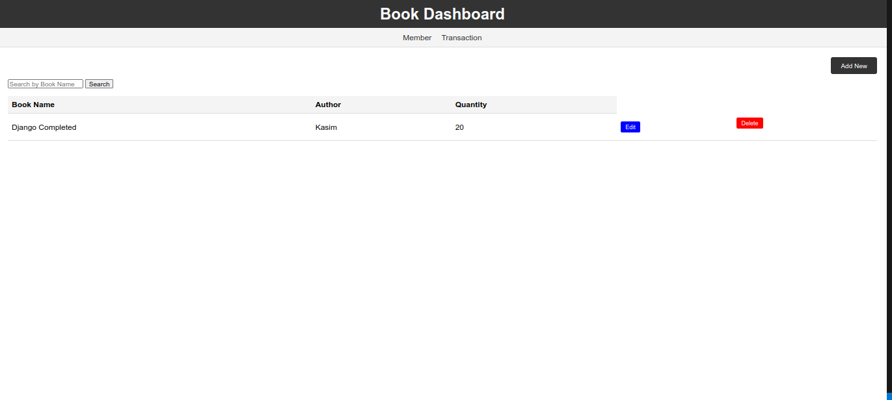
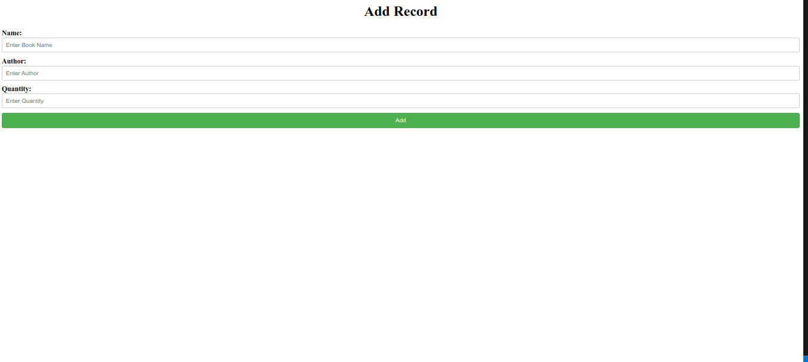
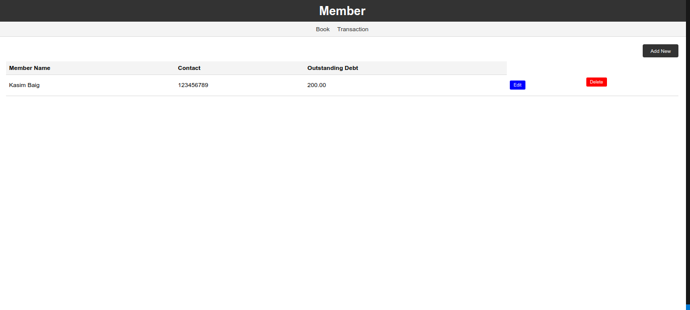
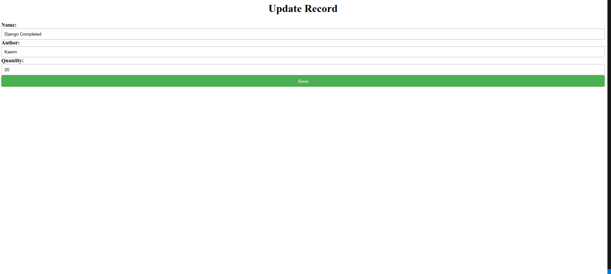
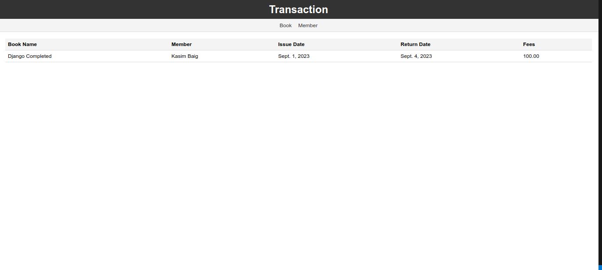

# library_management_django

## Project Description

Local libraries often struggle with manual book tracking and management. This web application simplifies library management by providing librarians with the tools to manage books, members, and transactions effectively.

### Base Library System

The application includes the following core features:

- **Books with Stock Maintenance:** Librarians can maintain a catalog of books, including information about the book title, author, ISBN, publisher, and quantity in stock.

- **Members:** Librarians can manage the library's members, including their details and outstanding debts.

- **Transactions:** Librarians can track transactions related to book issuances and returns.

The use cases covered by these features are:

- **CRUD Operations:** Perform general Create, Read, Update, and Delete operations on Books and Members.

- **Book Issuance:** Librarians can issue books to library members.

- **Book Return:** Librarians can handle book returns from members.

- **Book Search:** The application provides search functionality to find books by name and author.

- **Book Fee Charging:** The system can charge rent fees on book returns.

- **Debt Limit:** Ensures that a member's outstanding debt does not exceed Rs. 500.

